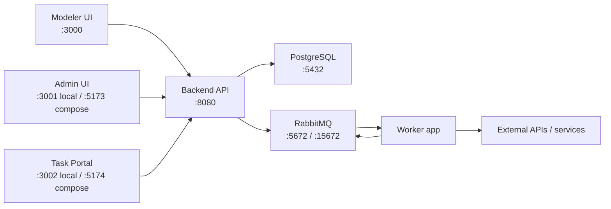
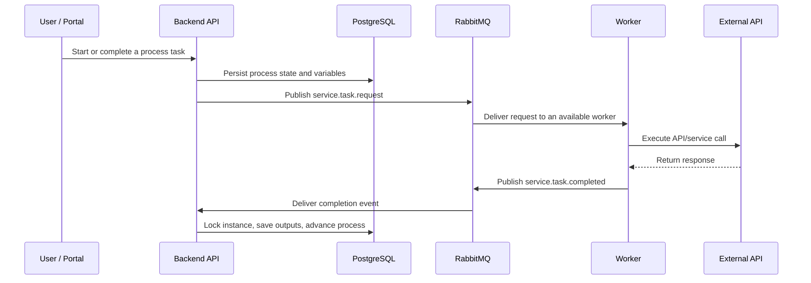

# EasyBPM

EasyBPM is a Kotlin/Spring Boot business process engine with a React modeler, an admin console, a task portal, and an async worker for external/API work. It stores process definitions as an internal JSON graph, persists process execution state in PostgreSQL, and uses RabbitMQ to hand long-running work to the worker.

## What Is In This Repository

| Path | Purpose |
| --- | --- |
| `src/main/kotlin/com/easy/bpm` | Main Spring Boot backend and BPM runtime |
| `worker/` | Second Spring Boot app that consumes RabbitMQ work and reuses backend classes |
| `easy-bpm-modeler/` | React/Vite process and form modeler |
| `easy-bpm-admin/` | React/Vite admin console for instances, variables, security, and code-task audits |
| `easy-bpm-task-portal/` | React/Vite portal for users to start processes and complete human tasks |
| `docs-site-working/` | Docusaurus documentation site |
| `src/test/kotlin/com/easy/bpm` | Unit, controller, repository, worker, and integration tests |
| `src/main/resources/db/migration` | Flyway migrations for the PostgreSQL schema |

## Architecture



Cluster-oriented runtime behavior:

- Backend replicas are horizontally scalable behind a load balancer; PostgreSQL remains the execution source of truth.
- Process resumes from task completion, service-task completion, message correlation, and timer callbacks lock the target process instance row before advancing execution.
- RabbitMQ separates service-task requests, service-task retries, service-task completions, DLQ events, message-received events, and message-expected observability events.
- Worker retries use the RabbitMQ retry queue with per-message TTL and dead-letter routing back to the request queue, so retries survive worker pod restarts.
- Scheduled timeout scanners use database row claiming patterns for clustered execution so multiple backend pods can run schedulers without processing the same timeout work.
- High-volume lookup paths for tasks, process variables, and worker requests have supporting PostgreSQL indexes.

The main runtime flow is:

1. A process is modeled in `easy-bpm-modeler/`.
2. The modeler exports an internal JSON graph, not BPMN XML.
3. The backend stores it in `ProcessDefinition.definitionJson`.
4. `ProcessService` deploys, starts, and executes process instances.
5. Human work is stored in `task` and `task_variable`.
6. API/service work is published to RabbitMQ and executed by `worker/`.
7. Completion messages resume waiting process instances in the backend.

Example async workflow:



In this model, RabbitMQ does not execute business logic. It stores and routes messages. The worker performs the external work, and the backend remains responsible for process state, variables, and deciding the next node.

## Main Capabilities

- Process deployment, versioning, starting, execution, stopping, and manual node movement.
- JSONB process and task variables with typed API responses.
- Human task claim and completion flows.
- Dynamic forms with stable `formId` references.
- Message catch/throw events with correlation keys.
- Parallel and exclusive gateway execution.
- Call activity/subprocess support with parent/child instance hierarchy and variable mappings.
- Async API task execution through RabbitMQ and the worker.
- Code-task jar upload, reflection metadata discovery, execution, and audit history.
- Document upload, preview, download, and task-form integration.
- JWT/RBAC security with bootstrapped admin user and group.
- Actuator health, metrics, and Prometheus endpoints.

## Prerequisites

- Java 21
- Docker and Docker Compose
- Node.js 18+ for the React apps
- Node.js 20+ for the Docusaurus docs site

## Quick Start: Local Development

Start PostgreSQL and RabbitMQ:

```bash
docker-compose up -d postgres rabbitmq
```

Run the backend:

```bash
./gradlew bootRun
```

Run the worker in another terminal:

```bash
./gradlew :worker:bootRun
```

Run the frontends as needed:

```bash
cd easy-bpm-modeler && npm install && npm run dev
cd easy-bpm-admin && npm install && npm run dev
cd easy-bpm-task-portal && npm install && npm run dev
```

Useful local URLs:

| Service | URL |
| --- | --- |
| Backend API | `http://localhost:8080` |
| Swagger UI | `http://localhost:8080/swagger-ui.html` |
| RabbitMQ management | `http://localhost:15672` |
| Modeler | `http://localhost:3000` |
| Admin UI | `http://localhost:3001` |
