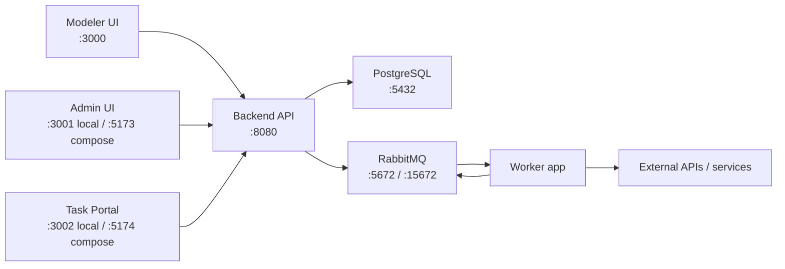

# EasyBPM

EasyBPM is a Kotlin/Spring Boot business process engine with a React modeler, an admin console, a task portal, and an async worker for external/API work. It stores process definitions as an internal JSON graph, persists process execution state in PostgreSQL, and uses RabbitMQ to hand long-running work to the worker.

## What Is In This Repository

| Path | Purpose |
| --- | --- |
| `src/main/kotlin/com/easy/bpm` | Main Spring Boot backend and BPM runtime |
| `worker/` | Second Spring Boot app that consumes RabbitMQ work and reuses backend classes |
| `easy-bpm-modeler/` | React/Vite process and form modeler |
| `easy-bpm-admin/` | React/Vite admin console for instances, variables, security, and code-task audits |
| `easy-bpm-task-portal/` | React/Vite portal for users to start processes and complete human tasks |
| `docs-site-working/` | Docusaurus documentation site |
| `src/test/kotlin/com/easy/bpm` | Unit, controller, repository, worker, and integration tests |
| `src/main/resources/db/migration` | Flyway migrations for the PostgreSQL schema |

## Architecture



The main runtime flow is:

1. A process is modeled in `easy-bpm-modeler/`.
2. The modeler exports an internal JSON graph, not BPMN XML.
3. The backend stores it in `ProcessDefinition.definitionJson`.
4. `ProcessService` deploys, starts, and executes process instances.
5. Human work is stored in `task` and `task_variable`.
6. API/service work is published to RabbitMQ and executed by `worker/`.
7. Completion messages resume waiting process instances in the backend.

## Main Capabilities

- Process deployment, versioning, starting, execution, stopping, and manual node movement.
- JSONB process and task variables with typed API responses.
- Human task claim and completion flows.
- Dynamic forms with stable `formId` references.
- Message catch/throw events with correlation keys.
- Parallel and exclusive gateway execution.
- Call activity/subprocess support with parent/child instance hierarchy and variable mappings.
- Async API task execution through RabbitMQ and the worker.
- Code-task jar upload, reflection metadata discovery, execution, and audit history.
- Document upload, preview, download, and task-form integration.
- JWT/RBAC security with bootstrapped admin user and group.
- Actuator health, metrics, and Prometheus endpoints.

## Prerequisites

- Java 21
- Docker and Docker Compose
- Node.js 18+ for the React apps
- Node.js 20+ for the Docusaurus docs site

## Quick Start: Local Development

Start PostgreSQL and RabbitMQ:

```bash
docker-compose up -d postgres rabbitmq
```

Run the backend:

```bash
./gradlew bootRun
```

Run the worker in another terminal:

```bash
./gradlew :worker:bootRun
```

Run the frontends as needed:

```bash
cd easy-bpm-modeler && npm install && npm run dev
cd easy-bpm-admin && npm install && npm run dev
cd easy-bpm-task-portal && npm install && npm run dev
```

Useful local URLs:

| Service | URL |
| --- | --- |
| Backend API | `http://localhost:8080` |
| Swagger UI | `http://localhost:8080/swagger-ui.html` |
| RabbitMQ management | `http://localhost:15672` |
| Modeler | `http://localhost:3000` |
| Admin UI | `http://localhost:3001` |
| Task portal | `http://localhost:3002` |
| Docs site | `http://localhost:9000` |

Default development credentials:

- App login: `admin` / `admin`
- RabbitMQ: `easybpm` / `easybpm`
- PostgreSQL: `meu_usuario` / `minha_senha`, database `easybpm`

## Docker Compose

The compose file can run infrastructure, backend, worker, frontends, and the docs site:

```bash
docker-compose up -d
```

Compose exposes:

| Service | Port |
| --- | --- |
| Backend | `8080` |
| RabbitMQ AMQP | `5672` |
| RabbitMQ management | `15672` |
| Admin UI | `5173` |
| Task portal | `5174` |
| Modeler | `3000` |
| Docs | `9000` |

Note: this checkout uses `easy-bpm-modeler/` as the modeler directory. If Docker Compose cannot start the modeler service, check that its volume path matches that directory.

## Backend API Landmarks

| Area | Routes |
| --- | --- |
| Authentication | `POST /auth/login`, `GET /auth/me` |
| Processes | `/processes`, `/processes/{processId}/start`, `/processes/messages` |
| Instances | `/processes/instances`, `/processes/instances/{id}`, `/processes/instances/{id}/variables` |
| Subprocesses | `/processes/instances/{id}/children`, `/parent`, `/mapping` |
| Tasks | `/tasks`, `/tasks/{id}`, `/tasks/{id}/claim`, `/tasks/{id}/complete` |
| Forms | `/forms`, `/forms/latest`, `/forms/{id}` |
| Documents | `/api/documents`, `/api/documents/{id}/download`, `/preview` |
| Code tasks | `/code-tasks/upload`, `/code-tasks/jar/{jarId}/classes`, `/code-tasks/executions` |
| Security admin | `/admin/users`, `/admin/groups` |
| Observability | `/actuator/health`, `/actuator/metrics`, `/actuator/prometheus` |

The public start endpoint uses a process key/string id:

```bash
curl -X POST http://localhost:8080/processes/order-approval/start \
  -H 'Content-Type: application/json' \
  -H 'Authorization: Bearer <token>' \
  -d '{"amount": 100, "requester": "alice"}'
```

## Configuration

The backend reads its main configuration from `src/main/resources/application.yml`.

Common environment overrides:

| Variable | Default |
| --- | --- |
| `SERVER_PORT` | `8080` |
| `SPRING_DATASOURCE_URL` | `jdbc:postgresql://localhost:5432/easybpm` |
| `SPRING_DATASOURCE_USERNAME` | `meu_usuario` |
| `SPRING_DATASOURCE_PASSWORD` | `minha_senha` |
| `SPRING_RABBITMQ_HOST` | `localhost` |
| `SPRING_RABBITMQ_PORT` | `5672` |
| `SPRING_RABBITMQ_USERNAME` | `easybpm` |
| `SPRING_RABBITMQ_PASSWORD` | `easybpm` |
| `easybpm.security.enabled` | `true` |

All three React apps default to `http://localhost:8080` and support `VITE_API_BASE_URL`.

```bash
VITE_API_BASE_URL=http://localhost:8080 npm run dev
```

## Worker Notes

External/API work is asynchronous by default. The backend publishes work to RabbitMQ, and `worker/src/main/kotlin/com/easy/bpm/worker/WorkerListener.kt` performs the HTTP/auth/retry/idempotency flow before publishing a completion or failure result.

Worker auth references are environment-based:

| Auth type | Environment lookup |
| --- | --- |
| Bearer | `$REF` |
| Basic | `${REF}_USERNAME` and `${REF}_PASSWORD` |
| API key | `$REF` |

## Tests And Verification

Backend tests:

```bash
./gradlew test
```

Integration tests use PostgreSQL Testcontainers through `IntegrationTestBase`, so keep Docker running when executing the full suite.

Frontend builds:

```bash
cd easy-bpm-modeler && npm run build
cd easy-bpm-admin && npm run build
cd easy-bpm-task-portal && npm run build
```

Modeler type check:

```bash
cd easy-bpm-modeler && npm run lint
```

Docs site:

```bash
cd docs-site-working && npm install && npm start
```

## Development Conventions

- Prefer the code over older docs when behavior differs.
- Process definitions are runtime JSON graphs, not BPMN XML.
- Modeler node types are lowercase/kebab internally and exported as backend-facing PascalCase names.
- Keep process and task variable payloads as native JSON.
- User-task form references should use stable `formId` values where possible.
- If adding sortable fields to list APIs, update the service allow-lists.
- Keep project documentation in `docs-site-working/`; avoid creating parallel docs folders.

## More Documentation

The Docusaurus site contains deeper guides:

- `docs-site-working/docs/architecture.md`
- `docs-site-working/docs/api-controllers.md`
- `docs-site-working/docs/message-events.md`
- `docs-site-working/docs/code-task-quick-start.md`
- `docs-site-working/docs/document-handling.md`
- `docs-site-working/docs/easy-modeler-getting-started.md`
- `docs-site-working/docs/easy-admin-getting-started.md`
- `docs-site-working/docs/easy-task-portal-getting-started.md`
