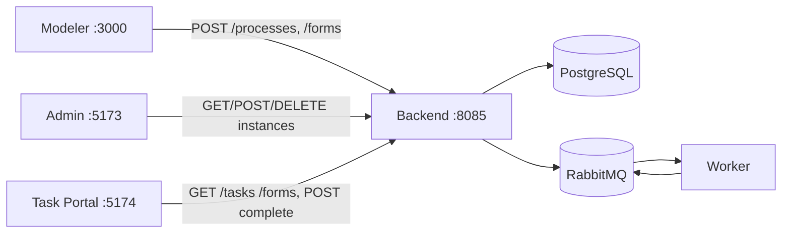
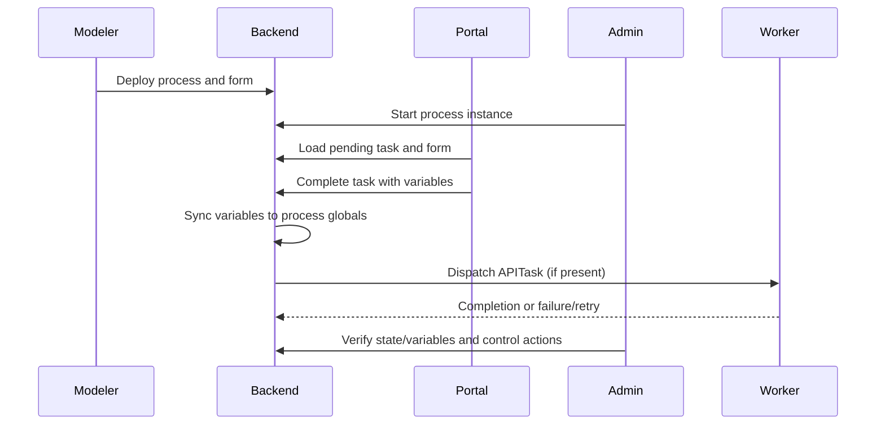

# First Phase QA Test Plan

This document defines the joint CTO + QA + Tech Writer validation strategy for the first delivery phase across:

- Easy BPMN Modeler
- Easy BPM Admin
- Easy BPM Task Portal

It includes scope, test scenarios, acceptance criteria, and a workflow JSON that can be used to drive execution.

## Scope

### In Scope

- Modeler process design and deploy flows
- Modeler form design and deploy flows
- APITask auth reference modeling (`bearer`, `basic`, `apikey`)
- Admin process instance monitoring and control (stop, delete, move node)
- Task Portal task inbox, dynamic form rendering, and complete-task
- Variable synchronization from task submission to process globals
- Cross-app integration on localhost ports:
  - Modeler: `3000`
  - Admin: `5173`
  - Task Portal: `5174`
  - Backend: `8085`

### Out of Scope

- Full authentication/authorization rollout (`POST /login` and token propagation)
- Non-functional load/stress benchmarks
- Production hardening checks outside current first-phase features

## Test Environment

### Required Services

1. Backend API and worker stack up and healthy
2. PostgreSQL and RabbitMQ reachable
3. UIs running on expected ports
4. CORS configured for all three UI origins when required

### Baseline Test Data

1. At least one deployable process definition with:
   - Start event
   - User Task with `formKey`
   - Optional APITask
   - End event
2. At least one form deployed with required and optional fields

## Workflow Library for Import and Execution

### Modeler-Importable Workflows

- [wf-message-events-e2e.json](/data/modeler-workflows/wf-message-events-e2e.json)
- [wf-gateway-exclusive-routing.json](/data/modeler-workflows/wf-gateway-exclusive-routing.json)
- [wf-gateway-parallel-sync.json](/data/modeler-workflows/wf-gateway-parallel-sync.json)
- [wf-api-auth-variants.json](/data/modeler-workflows/wf-api-auth-variants.json)
- [wf-boundary-error-recovery.json](/data/modeler-workflows/wf-boundary-error-recovery.json)
- [wf-boundary-message-recovery.json](/data/modeler-workflows/wf-boundary-message-recovery.json)
- [manifest.json](/data/modeler-workflows/manifest.json)

### Runtime-Only Workflow (Timer-like)

- [wf-message-timeout-timer-via-backend.json](/data/runtime-workflows/wf-message-timeout-timer-via-backend.json)

### Important Note About Timers

Current Modeler palette does not expose a dedicated timer node. For timer validation in this phase, use backend/API workflow execution with timeout-based message waiting (`MessageEvent` with `timeoutSeconds`).

### Important Note About Boundary Import

Boundary event samples are included, but after import you should re-attach boundary events in canvas to the intended task node before deploy.

## System Coverage Diagram



## End-to-End Validation Sequence



## Test Scenarios

### MODELER

#### SCN-MOD-001: Deploy Process Successfully

- Objective: Validate successful process deploy from Modeler.
- Preconditions:
  - Backend reachable at configured API base URL.
  - Valid process graph with required nodes.
- Steps:
  1. Open Process Modeler.
  2. Create start -> user task -> end flow.
  3. Click Deploy Process.
- Expected Results:
  - HTTP `2xx` on `POST /processes`.
  - Success toast shown.
  - Process appears in backend process catalog.

#### SCN-MOD-002: Deploy Form Successfully

- Objective: Validate form deployment from Form Modeler.
- Preconditions:
  - Valid `formKey` and form schema.
- Steps:
  1. Open Form Modeler.
  2. Create form fields and assign `formKey`.
  3. Click Deploy to API.
- Expected Results:
  - HTTP `2xx` on `POST /forms`.
  - Form retrievable via `GET /forms/{formKey}`.

#### SCN-MOD-003: APITask Auth Reference Contract

- Objective: Validate APITask auth modeling and payload contract.
- Preconditions:
  - APITask node present.
- Steps:
  1. Set `auth.type=bearer`, `auth.ref=PARTNER_TOKEN`.
  2. Export/deploy process.
  3. Repeat for `basic` and `apikey`.
- Expected Results:
  - Payload includes `properties.auth` with correct fields.
  - Deploy validation rejects blank/missing `auth.ref`.
  - `apikey` enforces `in in {header,query}` and non-empty key name.

#### SCN-MOD-004: Legacy Compatibility

- Objective: Validate compatibility with legacy `service` APITask shape.
- Preconditions:
  - Import definition using legacy `node.service`.
- Steps:
  1. Import legacy process JSON.
  2. Deploy from current modeler/backend.
- Expected Results:
  - Deploy accepted.
  - Runtime executes using normalized properties.

#### SCN-MOD-005: Message Start and Message Catch/Throw Coverage

- Objective: Validate message-centric nodes imported from workflow library.
- Preconditions:
  - `wf-message-events-e2e.json` imported.
- Steps:
  1. Import workflow.
  2. Verify `MessageStartEvent`, `MessageIntermediateCatchEvent`, `MessageIntermediateThrowEvent` presence.
  3. Export/deploy and execute correlation path.
- Expected Results:
  - Message node payload/correlation mappings are preserved.
  - Runtime can receive/throw messages with expected correlation behavior.

#### SCN-MOD-006: Boundary Event Recovery Paths

- Objective: Validate error and message boundary alternatives.
- Preconditions:
  - `wf-boundary-error-recovery.json` or `wf-boundary-message-recovery.json` imported.
- Steps:
  1. Re-attach boundary to target task in canvas.
  2. Export/deploy.
  3. Trigger primary success path and boundary path.
- Expected Results:
  - Alternate boundary path is reachable.
  - Main path and failover/interrupt path complete independently.

#### SCN-MOD-007: Parallel and Exclusive Gateway Regression Pack

- Objective: Validate gateway routing with workflow library samples.
- Preconditions:
  - `wf-gateway-exclusive-routing.json` and `wf-gateway-parallel-sync.json` imported.
- Steps:
  1. Execute exclusive gateway with each condition branch.
  2. Execute parallel split/join workflow.
- Expected Results:
  - Exclusive branch respects conditions.
  - Parallel branches synchronize at join.

### ADMIN

#### SCN-ADM-001: List Process Instances

- Objective: Validate instance visibility in Admin.
- Preconditions:
  - At least one active instance exists.
- Steps:
  1. Open Admin dashboard.
  2. Load instance list.
- Expected Results:
  - Instances render without client error.
  - Details reflect backend state.

#### SCN-ADM-002: Stop Instance

- Objective: Validate lifecycle stop operation.
- Preconditions:
  - Active instance available.
- Steps:
  1. Select instance.
  2. Trigger Stop.
- Expected Results:
  - `POST /processes/instances/{id}/stop` returns success.
  - Instance status transitions to cancelled/stopped state.

#### SCN-ADM-003: Delete Instance

- Objective: Validate hard delete operation.
- Preconditions:
  - Existing instance id.
- Steps:
  1. Select instance.
  2. Trigger Delete and confirm.
- Expected Results:
  - `DELETE /processes/instances/{id}` returns success.
  - Instance removed from list and subsequent fetch returns not found.

#### SCN-ADM-004: Move Node

- Objective: Validate manual node redirection.
- Preconditions:
  - Instance in active non-terminal state.
- Steps:
  1. Select instance.
  2. Request move to valid target node.
- Expected Results:
  - Backend accepts move.
  - Current node updates to requested target.

### TASK PORTAL

#### SCN-PRT-001: Task Inbox Load

- Objective: Validate pending task listing.
- Preconditions:
  - At least one pending user task.
- Steps:
  1. Open Task Portal.
  2. Inspect sidebar list.
- Expected Results:
  - Tasks render with identifiers and metadata.

#### SCN-PRT-002: Form Rendering by formKey

- Objective: Validate dynamic form rendering.
- Preconditions:
  - Task has `formKey` mapped to deployed form.
- Steps:
  1. Open task detail.
  2. Verify required/optional field rendering.
  3. Submit valid values.
- Expected Results:
  - Form schema fetched successfully.
  - Required validation enforced.
  - Submission accepted.

#### SCN-PRT-003: Variable Editor Fallback

- Objective: Validate no-form task fallback.
- Preconditions:
  - Task without `formKey`.
- Steps:
  1. Open task detail.
  2. Add/update/delete variable rows.
  3. Submit.
- Expected Results:
  - Typed values supported (`string`, `number`, `boolean`, `json`).
  - Completion payload includes edited variables.

#### SCN-PRT-004: Variable Sync to Process Globals

- Objective: Validate task submission promotion to process-global variables.
- Preconditions:
  - Active process with pending user task.
- Steps:
  1. Complete task with at least 3 variables.
  2. Query instance/process variables in backend/admin.
- Expected Results:
  - Submitted values exist as process globals.
  - Values available to subsequent tasks/gateways.

### CROSS-APP INTEGRATION

#### SCN-E2E-001: Modeler -> Runtime -> Portal -> Admin

- Objective: Validate full first-phase value chain.
- Preconditions:
  - Fresh process and form.
- Steps:
  1. Deploy process/form from Modeler.
  2. Start instance.
  3. Complete user task in Task Portal.
  4. Verify state and variables in Admin.
- Expected Results:
  - End-to-end execution completes without contract mismatch.
  - Admin and Portal views stay consistent with backend state.

#### SCN-E2E-002: APITask Runtime Auth Resolution

- Objective: Validate worker env-based secret resolution.
- Preconditions:
  - APITask with auth reference deployed.
  - Required env vars configured.
- Steps:
  1. Execute process path containing APITask.
  2. Observe worker completion outcome.
  3. Repeat with missing env var.
- Expected Results:
  - With env present: APITask request authenticated and completes.
  - With env missing: worker fails with clear missing-env error and applies retry/DLQ behavior.

#### SCN-E2E-003: Full Workflow Library Regression

- Objective: Run all Modeler-importable sample workflows as a release regression pack.
- Preconditions:
  - Workflow library files available under `/data/modeler-workflows`.
- Steps:
  1. Import each workflow from manifest.
  2. Validate graph and fix boundary attachments where applicable.
  3. Deploy and run scenario-specific checks.
- Expected Results:
  - All workflows import successfully.
  - Deploy contracts validated for all supported node types in library.
  - No blocking parser or validation errors.

#### SCN-RUN-001: Message Timeout as Timer Behavior (Backend/API)

- Objective: Validate timer-like timeout handling in current phase.
- Preconditions:
  - Runtime-only workflow `wf-message-timeout-timer-via-backend.json` deployed through backend API.
- Steps:
  1. Start instance and do not send message.
  2. Wait beyond `timeoutSeconds`.
  3. Inspect subscription and instance status.
- Expected Results:
  - Subscription transitions to `TIMEOUT`.
  - Process instance transitions to `FAILED` according to timeout handling.

## Acceptance Criteria (Release Gate)

### Functional Acceptance

1. All `SCN-MOD-*` scenarios pass.
2. All `SCN-ADM-*` scenarios pass.
3. All `SCN-PRT-*` scenarios pass.
4. `SCN-E2E-*` scenarios pass for at least one happy path and one failure path.
5. Workflow library import/deploy regression (`SCN-E2E-003`) passes.

### Contract Acceptance

1. APITask auth contract validated at deploy time.
2. Task completion payload preserves typed variable semantics.
3. Form and process keys resolve consistently across apps.

### Operational Acceptance

1. No blocking UI errors in browser console for covered scenarios.
2. Backend returns deterministic status codes/messages for validation failures.
3. Worker retry and DLQ behavior observable for forced failures.
4. Timeout/timer-like runtime behavior validated through `SCN-RUN-001`.

## JSON Workflow Pack for Test Execution

Use this artifact to drive QA execution order, ownership, and expected checks:

- [`/data/qa-first-phase-workflows.json`](/data/qa-first-phase-workflows.json)

### Minimal Example

```json
{
  "phase": "first-phase",
  "workflows": [
    {
      "id": "WF-E2E-01",
      "name": "Modeler to Portal to Admin",
      "scenarios": ["SCN-MOD-001", "SCN-MOD-002", "SCN-PRT-002", "SCN-PRT-004", "SCN-ADM-001"],
      "acceptance": [
        "Process and form deployed",
        "Task completed successfully",
        "Variables promoted to process globals"
      ]
    }
  ]
}
```

## Execution and Reporting Model

1. Execute scenario groups in order: Modeler -> Portal -> Admin -> Cross-app.
2. Log result per scenario as `PASS`, `FAIL`, or `BLOCKED`.
3. Attach evidence:
   - API request/response snippets
   - Screenshots for UI checks
   - Worker/backend logs for async and failure-path checks
4. Open defects with exact scenario id and acceptance criterion violated.

## Traceability Matrix

| Feature Area | Scenario IDs | Acceptance Group |
|---|---|---|
| Modeler Deploy and Import | SCN-MOD-001, SCN-MOD-002, SCN-MOD-005, SCN-MOD-006, SCN-MOD-007 | Functional |
| APITask Auth Ref | SCN-MOD-003, SCN-MOD-004, SCN-E2E-002 | Contract + Operational |
| Admin Controls | SCN-ADM-001..004 | Functional |
| Task Portal Forms/Variables | SCN-PRT-001..004 | Functional + Contract |
| End-to-End Cohesion | SCN-E2E-001..003 | Functional + Operational |
| Timer-like Runtime Timeout | SCN-RUN-001 | Operational |
